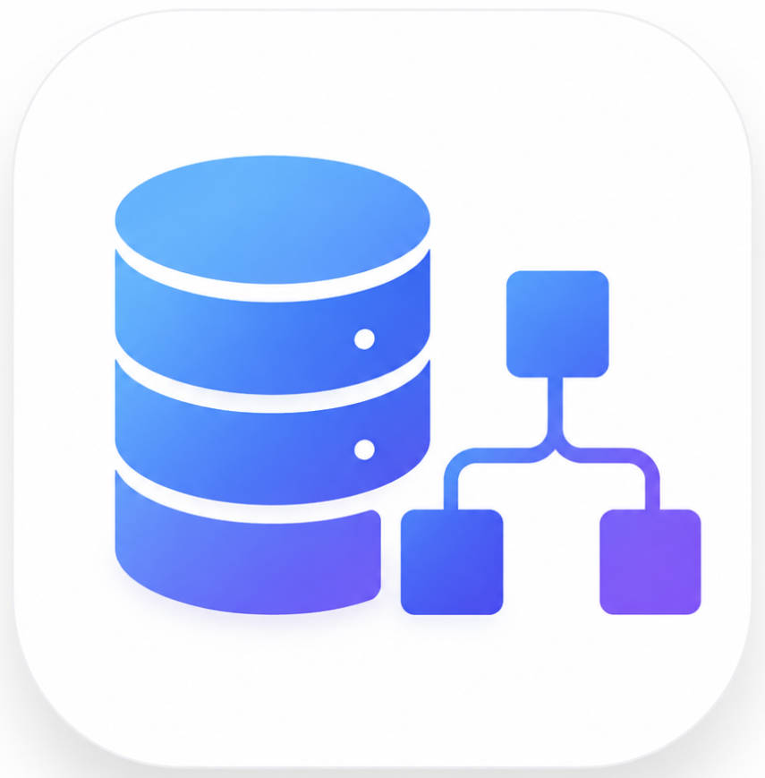
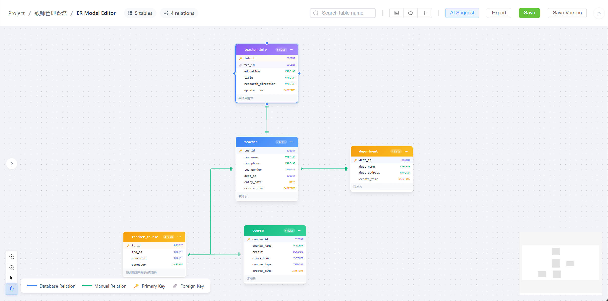

<div align="center">
  
  <h1>AI Database Architect</h1>
  <p>
    <b>Next generation database schema design powered by AI</b>
  </p>
  <p>
    An intelligent, open-source database modeling tool that reverse-engineers your existing databases (or imports DDL / DBML),
    then turns them into clear ER diagrams, concept models and governed, well-documented schema designs with AI assistance.
  </p>
  <p>Available for Windows.</p>

<p>
    <a href="https://github.com/sleepy-ailurus/AIDatabaseArchitect/blob/main/LICENSE">
      
    </a>
    
    <a href="https://github.com/sleepy-ailurus/AIDatabaseArchitect/releases">
      
    </a>
  </p>

<p>
    <a href="https://github.com/sleepy-ailurus/AIDatabaseArchitect">Website</a> |
    <a href="#features">Features</a> |
    <a href="#download-and-installation">Downloads</a> |
    <a href="#development">Development</a> |
    <a href="#mcp-server">MCP Server</a>
  </p>
</div>

---

## Screenshot

<div align="center">
  
</div>

---

## Features

### Modeling

- **Interactive ER Modeling** — Drag-and-drop ER diagram editor with automatic layout, relationship rendering (crow's foot notation), one-click table editing, and full-canvas image export (PNG / JPEG / SVG).
- **ER Concept Model Conversion** — One-click reverse conversion from the physical ER model to a Chen-notation concept model (entities, attributes, relationships with 1/N cardinality), with optional AI-generated relationship names.
- **Offline Schema Import** — Paste DDL (MySQL / PostgreSQL) or import DBML files to build a complete model **without connecting to a database**. `COMMENT ON` statements are parsed so table/column comments survive the import.
- **Business Domain Clustering** — Automatically group hundreds of tables into business domains (modularity-based community detection), explore them in a two-layer overview, and let AI name each domain.

### AI Intelligence

- **AI-Powered Relationship Analysis** — Rule + LLM suggestions for logical foreign keys with confidence scoring, type validation and an interactive review workflow.
- **AI Architecture Review & Health Check** — Rule-based lint (missing primary keys, unindexed foreign keys, type mismatches, naming conventions, reserved words, missing comments, redundant indexes...) plus AI review, all with prioritized fixes.
- **AI Comment Completion & Data Dictionary** — Batch-generate Chinese table/column comments, review and accept them, write back to the database (MySQL / PostgreSQL), and export data dictionaries as Excel / Word / Markdown. Confirmed comments appear directly on the ER canvas (hover to view).
- **Sensitive Data Identifier** — Automatically flag GDPR / PIPL privacy fields (phone, ID card, password, bank card, health...), with optional read-only data sampling and a compliance report export.
- **SQL Lineage & Impact Analysis** — Paste SQL to map table dependencies, inspect per-statement sources/targets, and see what a change would affect. Highlight the involved tables directly in the ER canvas.
- **Schema Q&A via MCP** — Ask questions about any modeled schema through the built-in MCP server (see below).

### Engineering & Governance

- **Schema Version Timeline & Diff** — Every sync or DDL/DBML import creates a schema snapshot; compare any two snapshots and get a structured change report (tables, columns, indexes, foreign keys) exportable as Markdown.
- **Smart Test Data Generator** — Schema-aware, FK-preserving sample data (Chinese names, phones, emails, amounts, status enums...) generated as SQL or inserted directly into a test database.
- **Design Document Generator** — One-click course-design / graduation-project database design documents (Markdown / Word) assembled from the concept model, table structures and relationships.
- **Document Export** — Markdown design docs with Mermaid ER diagrams, plus data dictionaries in Excel / Word / Markdown.

### Platform

- **Multi-Database Support** — Design once and target MySQL and PostgreSQL.
- **LLM Configuration** — Bring your own OpenAI-compatible API key (DeepSeek, Qwen, Ollama, ...) with per-purpose model selection, rate limiting and connectivity tests.
- **Project Management** — Organize multiple database designs into projects with ER model version history (save / restore / delete).
- **Clean Desktop UI** — Modern Vue3-based interface packaged as a native Windows application, fully localized in Chinese and English.

---

## Download and Installation

### Windows

Requires **Windows 10 or 11** (x64).

1. Go to the [Releases](https://github.com/sleepy-ailurus/AIDatabaseArchitect/releases) page.
2. Download the installer for your architecture:
   - `AIDatabaseArchitect-win-x64-v1.1.0-setup.exe`
3. Run the setup wizard and follow the on-screen instructions.
4. Launch **AI Database Architect** from the Start menu or desktop shortcut.

> The application is packaged as a standalone Windows installer. No manual Python or Node.js setup is required.
>
> Data is stored locally per user under `%APPDATA%\AIDatabaseArchitect\app.db` and is created automatically on first launch.

Want to see what changed? Check the [CHANGELOG](https://github.com/sleepy-ailurus/AIDatabaseArchitect).

---

## Development

AI Database Architect is built with a Python **FastAPI** backend and a **Vue 3 + Vite** frontend.

### Prerequisites

- Python 3.10+
- Node.js 21+
- uv (recommended) or pip

### Backend

```bash
cd backend

# Option 1: uv (recommended)
uv sync
uv run python run.py

# Option 2: pip only
pip install -r requirements.txt
python run.py
```

> The backend starts on http://localhost:8000 and the MCP server on
> http://localhost:8001.

### Frontend

```bash
cd frontend
npm install
npm run dev          # starts on http://localhost:5173
```

The frontend proxies API calls to `http://localhost:8000` during development.

### MCP Server

AI Database Architect exposes a read-only [MCP](https://modelcontextprotocol.io) server so AI coding tools can understand your database models:

- **stdio (local agents)**:

  ```bash
  cd backend
  python run.py --mcp
  ```

  Then register it, for example with Claude Code:

  ```bash
  claude mcp add ai-database-architect -- python run.py --mcp
  ```

- **Streamable HTTP** (started automatically with the app on `http://127.0.0.1:8001/mcp`):

  ```bash
  claude mcp add --transport http ai-database-architect http://127.0.0.1:8001/mcp
  ```

- **可选 Token 校验**：默认关闭。如需保护 MCP HTTP 接口，设置环境变量 `MCP_AUTH_TOKEN`（可写入 `backend/.env`）并重启后端，之后所有 HTTP 工具调用都必须携带 `Authorization: Bearer <token>`。例如在 Codex 的 `~/.codex/config.toml` 中：

  ```toml
  [mcp_servers.testaidatabase]
  url = "http://127.0.0.1:8001/mcp"
  http_headers = { "Authorization" = "Bearer <你的token>" }
  ```

  HTTP 端点始终启用 DNS rebinding / 跨站 Origin 防护（仅允许 localhost 来源）；stdio 模式不走网络，不受 Token 影响。

  注意：WorkBuddy 等客户端的自定义请求头字段是 `headers`（不是 `auth_token`），例如：

  ```json
  {
    "mcpServers": {
      "my-python-server": {
        "type": "http",
        "url": "http://127.0.0.1:8001/mcp",
        "disabled": false,
        "headers": { "Authorization": "Bearer <你的token>" }
      }
    }
  }
  ```

Available tools: `list_projects`, `get_project`, `list_tables`, `get_table_schema`, `list_relationships`, `export_er_diagram`, `ask_schema`.

If you have questions or run into issues, feel free to open an [issue](https://github.com/sleepy-ailurus/AIDatabaseArchitect/issues).

---

## License

[MIT](LICENSE)

---

诚邀共创：欢迎到 [讨论区](https://github.com/sleepy-ailurus/AIDatabaseArchitect/discussions) 分享你的想法与建议，也可以联系 QQ：1104219140@qq.com。
