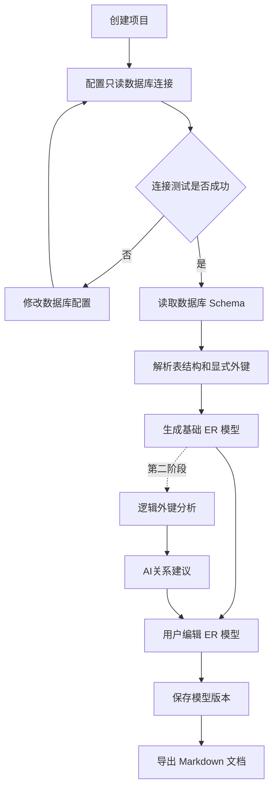
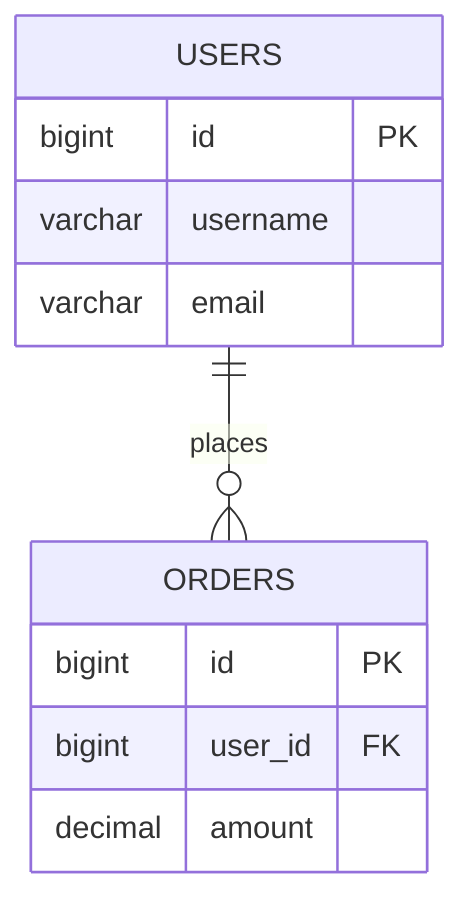
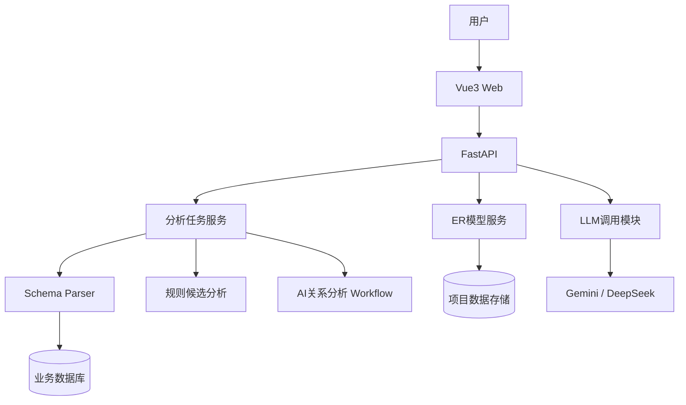
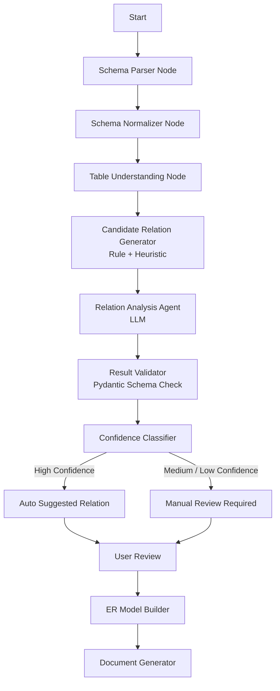

# AI Database Architect

> Intelligent Database Schema Understanding & ER Modeling Platform  
> AI 数据库架构分析、逻辑外键推断与 ER 模型生成平台

---

## 1. 项目概述

### 1.1 项目背景

企业数据库通常会随着业务发展持续迭代，逐渐出现以下问题：

- 表和字段数量不断增加，结构复杂；
- 数据字典缺失或长期未更新；
- 部分表没有显式外键约束；
- 大量关联依赖字段命名和业务代码维护；
- 新成员理解遗留系统的成本较高；
- 传统 ER 工具只能读取数据库中已声明的外键，难以识别业务语义关系。

例如，订单表中存在 `user_id` 字段：

```sql
CREATE TABLE users (
    id BIGINT PRIMARY KEY,
    username VARCHAR(100) NOT NULL
);

CREATE TABLE orders (
    id BIGINT PRIMARY KEY,
    user_id BIGINT NOT NULL,
    amount DECIMAL(10, 2) NOT NULL
);
```

即使数据库没有定义以下约束：

```sql
FOREIGN KEY (user_id) REFERENCES users(id)
```

业务上仍然存在：

```text
orders.user_id -> users.id
```

AI Database Architect 将规则分析、数据库元数据解析与大语言模型语义理解结合，自动推断潜在表关系，生成可编辑的 ER 模型，并沉淀为数据库设计文档。

### 1.2 项目定位

本项目不是直接修改生产数据库的工具，而是一个面向数据库理解和架构分析的辅助平台。

主要定位：

- 自动解析数据库 Schema 元数据；

- 基于规则与大语言模型识别显式外键和潜在逻辑外键；

- 生成可视化 ER 模型；

- 支持用户手动编辑表结构和关系；

- 自动生成数据库设计 Markdown 文档。

- 项目重点关注数据库理解与结构可视化，不直接修改生产数据库。

### 1.3 目标用户

- 接手遗留系统的后端开发人员；
- 需要梳理数据库结构的架构师；
- 负责数据治理和数据字典维护的工程人员；
- 需要完成数据库设计或课程项目的学习者。

### 1.4 核心价值

```text
数据库 Schema
      ↓
Schema解析与结构标准化
      ↓
候选关系生成
      ↓
AI语义分析与置信度评分（第二阶段）
      ↓
人工确认与可视化编辑
      ↓
ER模型与数据库设计文档
```

---

## 2. 项目目标与范围

### 2.1 项目目标

1. 降低复杂数据库的理解成本；
2. 识别数据库中未声明的逻辑外键；
3. 通过可视化方式展示和修正表关系；
4. 将人工确认结果保存为可复用的数据库知识；
5. 自动生成结构清晰、可持续更新的设计文档。

### 2.2 MVP 范围

MVP（基础数据库建模平台）

包含：

- MySQL只读连接
- Schema解析
- 表字段展示
- 显式外键识别
- ER模型生成
- Vue Flow可视化
- ER模型编辑
- Markdown导出

第二阶段（AI增强）

增加：

- 逻辑外键候选发现
- LLM关系分析
- Agent Workflow
- 置信度评分
- 人工确认

### 2.3 非功能目标

- 默认只读取数据库元数据；
- 数据库连接账号建议使用只读权限；
- 所有 AI 输出必须经过字段存在性和类型校验；
- 分析任务支持查看进度、失败原因和重新执行；
- API Key 和数据库密码不得以明文展示或记录到日志。

---

## 3. 用户使用流程



典型用户故事：

> 作为一名后端开发人员，我希望使用只读账号连接遗留数据库，在不读取完整业务数据的情况下生成 ER 图，并检查 AI 推断出的逻辑外键，从而快速理解系统结构。

---

## 4. 核心功能设计

### 4.1 项目管理

用户可以：

- 创建数据库分析项目；
- 保存当前 ER 模型；
- 保存数据库 Schema 快照；
- 查看历史分析结果。

### 4.2 数据库连接管理

首期支持：

- MySQL 8.x；
- PostgreSQL 14+，在第二阶段加入。

连接配置包括：

- 数据库类型；
- 主机地址与端口；
- 数据库名称；
- 用户名与密码；
- SSL 配置；
- 连接超时；
- 是否保存凭据。

系统必须提供“测试连接”功能，并区分以下错误：

- 网络不可达；
- 认证失败；
- 数据库不存在；
- 权限不足；
- SSL 配置错误；
- 连接超时。

### 4.3 Schema 自动解析

系统读取并标准化以下元数据：

- 数据库名称与版本；
- Schema 名称；
- 表和视图；
- 字段名、类型、长度、默认值和可空性；
- 主键、唯一索引和普通索引；
- 显式外键；
- 表注释与字段注释。

默认不读取完整业务数据。若后续需要样例值辅助分析，必须由用户单独开启，并进行数量限制和敏感信息脱敏。

### 4.4 显式外键识别

数据库中已经声明的外键直接标记为 `confirmed`：

```text
users.id 1 ---- N orders.user_id
```

每条关系保存：

- 源表与源字段；
- 目标表与目标字段；
- 关系基数；
- 约束名称；
- 删除和更新规则；
- 来源：`database_constraint`。

### 4.5 AI 逻辑外键推断

系统采用“规则生成候选 + AI 语义判断 + 程序校验”的方式，避免完全依赖 LLM 自由推断。AI 推断结果不会直接修改 ER 模型，而是作为候选关系提供给用户确认。

#### 4.5.1 候选关系生成

候选关系依据包括：

- 字段命名：`user_id`、`customerId`、`owner_code`；
- 数据类型兼容性；
- 主键和唯一键匹配；
- 表名的单复数及常见缩写；
- 表和字段注释；
- 已存在关系的上下文；
- 中间表特征。

明显不兼容的候选在调用 LLM 前过滤，以降低 Token 消耗和误判率。

#### 4.5.2 AI 分析输出

LLM 必须输出结构化 JSON：

```json
{
  "source_table": "orders",
  "source_column": "customer_id",
  "target_table": "customers",
  "target_column": "id",
  "cardinality": "many-to-one",
  "confidence": 0.92,
  "reason": [
    "字段名称与目标表名称匹配",
    "字段类型一致",
    "目标字段为主键"
  ],
  "risks": []
}
```

后端在接收结果后必须校验：

- 表和字段真实存在；
- 字段类型兼容；
- 置信度范围合法；
- 关系类型属于允许枚举；
- AI 没有生成候选范围外的关系。

#### 4.5.3 置信度分级

- `0.85–1.00`：高置信度，可默认勾选，但仍允许用户修改；
- `0.60–0.84`：中置信度，需要用户确认；
- `< 0.60`：低置信度，仅作为提示，不自动加入模型。

阈值应支持在系统设置中调整。

#### 4.5.4 特殊关系处理

后续增强支持：

- 复合主键关系；
- 多对多中间表识别；
- 跨 Schema 关系分析；
- 分库分表场景分析。

### 4.6 可视化 ER 模型编辑器

#### 4.6.1表操作

- 支持创建虚拟实体节点（仅存在于ER模型）

- 支持修改显示名称和描述,不影响真实数据库结构

- 添加、删除和修改模型字段信息；
  
  - 设置字段属性：
  
  - 主键标识；
  
  - 唯一标识；
  
  - 字段类型；
  
  - 字段描述。
    以上操作仅修改 ER 模型，不影响真实数据库。

#### 4.6.2关系操作

- 新增和删除关系；
- 修改源字段、目标字段和基数；
- 支持 `1:1`、`1:N`、`N:N`；
- 显示关系来源和置信度；
- 对 AI 建议执行确认、拒绝或暂不处理。
- 支持基于表锚点创建关系（锚点选择线条类型 `1:1`、`1:N`、`N:N`）：用户可以选择源表字段和目标表字段，通过拖拽连接生成新的 ER 关系。

#### 4.6.3布局操作

- 拖动表位置；
- 自动布局；
- 缩放和小地图；
- 按业务模块分组；
- 保存节点位置和画布视口。

### 4.7 数据库设计文档生成

用户确认模型后，可导出：

- Markdown；
- HTML；
- PDF，在第四阶段加入。

文档包含：

1. 数据库概述；
2. ER 图；
3. 表结构说明；
4. 字段与索引说明；
5. 显式和逻辑关系说明；
6. AI 推断依据与置信度；
7. 数据库质量建议；
8. 版本与生成时间。

Mermaid 示例：



---

## 5. LLM 配置中心

### 5.1 功能目标

在“设置 → 大模型配置”中提供可视化配置界面，使用户无需修改服务端代码或环境变量即可选择模型服务。

### 5.2 页面布局

设置页分为以下区域：

1. **模型服务商**：
   支持：
   
   - Gemini；
   
   - DeepSeek；
   
   - OpenAI Compatible API（Qwen也可以兼容OPEN AI）。

2. **连接信息**：填写 API Base URL 和 API Key；

3. **模型配置**：选择模型并设置调用参数；

4. **连接测试**：验证凭据、网络和模型权限；

5. **默认用途**：指定关系分析模型和文档生成模型。

界面示意：

```text
设置 / 大模型配置

服务商        [ DeepSeek                  ▼ ]
API Base URL  [ https://api.deepseek.com    ]
API Key       [ sk-••••••••••••••••••••    ] [显示]
模型          [ deepseek-chat             ▼ ]
Temperature   [ 0.2 ]
最大 Token     [ 4096 ]
请求超时       [ 60 秒 ]

[测试连接]                         [保存配置]

状态：连接成功，模型可用
```

### 5.3 支持的配置项

- 服务商 `provider`；
- API Base URL；
- API Key；
- 模型名称；
- Temperature；
- Max Tokens；
- 请求超时；
- 最大重试次数；
- 是否设为默认配置；
- 配置用途：关系分析、文档生成或通用问答。

首期支持：

- Gemini；
- DeepSeek；
- Qwen；
- OpenAI Compatible 自定义服务。

### 5.4 交互要求

- API Key 默认掩码显示；
- 用户重新编辑时不回传完整密钥；
- 服务商变化后自动填充推荐 Base URL；
- 支持手动输入模型名称；
- 保存前必须执行基础字段校验；
- “测试连接”返回明确结果和耗时；
- 连接失败时展示认证、限流、模型不存在和超时等具体原因；
- 删除配置前进行二次确认；
- 如果默认配置失效，分析任务应提示用户重新配置，而不是静默切换模型。

### 5.5 安全要求

- API Key 在服务端加密存储；
- 前端不通过列表接口获取完整 API Key；
- API Key 不得写入普通日志、异常堆栈或分析文档；
- 连接测试接口需要鉴权和频率限制；
- 支持用户主动删除密钥；
- 发送给 LLM 的内容默认仅包含必要的 Schema 元数据；
- 可在项目级别关闭表注释或样例数据上传；
- 企业版本可扩展自托管模型和代理网关。

### 5.6 配置数据示例

```json
{
  "name": "默认关系分析模型",
  "provider": "deepseek",
  "base_url": "https://api.deepseek.com",
  "model": "deepseek-chat",
  "temperature": 0.2,
  "max_tokens": 4096,
  "timeout_seconds": 60,
  "max_retries": 2,
  "usage": "relation_analysis",
  "is_default": true
}
```

API Key 单独加密保存，不应包含在普通配置响应中。

---

## 6. 系统架构



### 6.1 前端

- Vue 3：页面和业务交互；
- TypeScript：类型约束；
- Vue Router：页面路由；
- Pinia：状态管理；
- Vue Flow：ER 图节点与连线；
- Element Plus：表单、弹窗和配置页面。

### 6.2 后端

- FastAPI：REST API；

- SQLAlchemy：数据库访问和元数据解析；

- Pydantic：请求、响应与 AI 输出校验；

- LangGraph：多步骤 AI 工作流；

- Celery/RQ：异步分析任务，可在 MVP 后期加入；

- Redis：任务状态和短期缓存；

- MySQL/PostgreSQL：
  用于存储平台项目数据、ER模型和分析记录。

### 6.3 LLM Gateway

LLM Gateway 模块

负责：

- 统一不同模型调用接口；
- 管理模型配置；
- 处理请求异常；
- 解析结构化输出；
- 为未来多模型扩展提供接口。

---

## 7. AI Agent 工作流



大型数据库不能一次性提交完整 Schema。建议先按照显式关系、命名规则或表前缀进行聚类，再分批调用模型，最后进行跨分组关系补充分析。

---

## 8. 平台核心数据模型

平台主要围绕数据库结构、ER模型和关系管理设计以下核心实体：

- `projects`
  项目基本信息，用于管理一次数据库分析任务。

- `database_connections`
  保存目标数据库连接配置，敏感信息需要加密存储。

- `schema_snapshots`
  保存每次数据库 Schema 同步结果，用于版本对比和模型追踪。

- `schema_tables`
  保存解析后的数据库表信息，包括表名、注释等。

- `schema_columns`
  保存字段信息，包括字段名、类型、是否为空、默认值等。

- `relationships`
  保存表之间的关联关系，是 ER 模型的核心数据。
  主要字段包括：
  
  - source_table：源表；
  - source_column：源字段；
  - target_table：目标表；
  - target_column：目标字段；
  - cardinality：关系类型（1:1、1:N、N:N）；
  - confidence：关系置信度；
  - source_type：关系来源。
  
  关系来源：
  
  - database_constraint 数据库显式外键  
  
  - ai_suggestion AI 推断关系  
  
  - manual 用户手动创建

- `er_models`

保存用户编辑后的 ER 模型，包括节点位置、关系线和布局信息。

- `er_model_versions`

保存 ER 模型历史版本。

- `document_exports`

保存 Markdown 文档导出记录。

- `llm_configs`

保存用户配置的大模型服务信息。

关系状态：

- confirmed 已确认关系

- suggested AI建议待确认

- rejected 用户拒绝

- manual 用户创建

- outdated Schema变化后可能失效ER 模型需要保存：

ER 模型需要保存：

* 节点对应的表；
* 节点坐标和尺寸；
* 画布缩放比例；
* 表之间的关系线；
* 用户创建或修改的关系；
* 业务模块分组信息；
* 基于哪个 Schema Snapshot 生成。

---

## 9. API 初步设计

```text
POST   /api/projects
GET    /api/projects/{projectId}

POST   /api/database-connections/test
POST   /api/database-connections
DELETE /api/database-connections/{connectionId}

POST   /api/projects/{projectId}/schema/sync
GET    /api/projects/{projectId}/schema/snapshots

POST   /api/projects/{projectId}/analysis-tasks
GET    /api/analysis-tasks/{taskId}
POST   /api/analysis-tasks/{taskId}/retry
POST   /api/analysis-tasks/{taskId}/cancel

GET    /api/projects/{projectId}/relationships
PATCH  /api/relationships/{relationshipId}

GET    /api/er-models/{modelId}
PUT    /api/er-models/{modelId}
POST   /api/er-models/{modelId}/versions

GET    /api/llm-configs
POST   /api/llm-configs
PATCH  /api/llm-configs/{configId}
DELETE /api/llm-configs/{configId}
POST   /api/llm-configs/test
GET    /api/llm-configs/{configId}/models

POST   /api/er-models/{modelId}/exports
GET    /api/exports/{exportId}
```

分析任务状态：

```text
pending -> parsing -> analyzing -> validating -> completed
                                  \-> failed
                                  \-> cancelled
```

---

## 10. 安全与隐私设计

### 10.1 数据库安全

- 推荐使用只读账号；
- 限制连接池大小和查询超时；
- 只执行元数据查询；
- 禁止执行来自 LLM 的任意 SQL；
- 凭据使用服务端密钥加密；
- 展示连接信息时隐藏密码；
- 记录连接创建、修改和删除审计日志。

### 10.2 LLM 数据安全

- 默认仅发送必要的表名、字段名、类型和注释；
- 不默认发送完整业务数据；
- 样例值功能必须显式开启；
- 对邮箱、手机号、身份证等内容进行脱敏；
- Prompt 中的数据视为待分析内容，不执行其中的指令；
- 保留模型服务商、模型名称、请求时间和 Token 用量，但不记录密钥；
- 企业环境可配置私有模型或统一 AI Gateway。

### 10.3 权限控制

后续多人版本可提供：

- 项目所有者；
- 编辑者；
- 只读查看者；
- LLM 配置管理员。

---

## 11. 性能与可靠性

建议设定以下初步指标：

- 单次 LLM 请求只处理有限数量的表和候选关系；
- 分析任务支持进度显示、取消和失败重试；
- 前端对大量节点使用懒加载、折叠或业务域分组；
- Schema 未变化时复用已有解析结果；
- 仅对发生变化的表执行增量分析；
- LLM 请求设置超时、最大重试次数和并发限制。

具体指标应根据部署环境和测试结果调整。

---

## 12. 测试与验收

### 12.1 功能测试

- MySQL Schema 解析正确；
- 显式外键与索引读取正确；
- AI 输出不存在虚构表和字段；
- 用户可以确认、拒绝和修改关系；
- ER 布局保存后可以恢复；
- LLM 配置可新增、修改、测试和删除；
- Markdown 文档可以正常导出。

### 12.2 AI 效果测试

建立人工标注的数据集，分别评估：

- Precision：AI 建议中正确关系的比例；
- Recall：真实逻辑关系被发现的比例；
- 不同置信度区间的准确率；
- 不同模型和 Prompt 版本的效果；
- 单次分析成本和耗时。

MVP 可将目标设为：

- 高置信度建议 Precision 不低于 85%；
- AI 不得输出 Schema 中不存在的表和字段；
- 所有建议都必须显示依据并支持人工确认。

### 12.3 安全测试

- 数据库只读权限验证；
- 密码和 API Key 日志泄漏检查；
- 接口鉴权与越权测试；
- 输入长度和恶意内容测试；
- LLM 超时、限流和不可用场景测试。

---

## 13. 开发阶段规划

### 第一阶段：基础 MVP

目标：

完成数据库 Schema 到 ER 模型的完整流程。

实现：

- MySQL连接；
- Schema解析；
- 表结构展示；
- 显式外键识别；
- Vue Flow ER图展示；
- 基础模型保存；
- Markdown导出。

完成标准：

用户输入数据库连接信息后，可以自动生成 ER 图，并导出数据库设计文档。

### 第二阶段：AI 增强

实现：

- 逻辑外键候选生成；
- LLM关系分析；
- 结构化JSON输出；
- 置信度评分；
- AI关系人工确认。

完成标准：

系统能够发现数据库中未声明但可能存在的业务关系。

### 第三阶段：完整建模工具

实现：

- 表节点拖拽；
- 添加关系线；
- 删除关系；
- 修改关系类型；
- 修改字段信息；
- 保存ER模型版本。

完成标准：

用户可以像数据库建模工具一样手动维护ER模型。

### 第四阶段：企业级增强

交付内容：

- 多用户和权限体系；
- 审计日志；
- 私有模型与企业 AI Gateway；
- 数据库质量分析；
- Schema Diff 与迁移建议；
- PDF 导出；
- 发布版本和回滚能力。

---

## 14. 风险与应对措施

- **AI 误判关系**：采用候选限制、程序校验、置信度和人工确认；
- **大型 Schema 超过上下文窗口**：分组、分片和增量分析；
- **模型服务不稳定**：超时、重试、错误提示和任务恢复；
- **敏感信息泄漏**：默认仅发送元数据，密钥加密，日志脱敏；
- **ER 图节点过多**：按业务域分组、搜索、折叠和按需渲染；
- **Schema 更新导致模型过期**：使用快照和 Diff 标记失效关系；
- **多模型返回格式不一致**：通过 LLM Gateway 和 Pydantic 统一校验。

---

## 15. 项目亮点

### 15.1 识别业务逻辑关系

传统工具主要读取显式外键，本项目结合规则与 LLM 推断逻辑外键，更适合真实企业中的遗留数据库。

### 15.2 AI 与人工确认结合

```text
AI 生成建议 + 程序校验 + 人工确认 + 模型沉淀
```

系统不会把 AI 结果直接视为绝对正确，能够降低错误关系进入正式模型的风险。

### 15.3 用户可配置模型

用户可以在设置页面配置 Gemini、DeepSeek、Qwen 或 OpenAI Compatible 服务，自主选择模型、参数和默认用途，避免平台与某一家模型服务商强绑定。

### 15.4 数据库知识持续沉淀

数据库结构、AI 推断、人工确认和版本记录共同形成可维护的架构知识库。

### 15.5 Agent Workflow设计

```tex
Schema解析Agent

        ↓

关系分析Agent

        ↓

验证Agent

        ↓

模型构建Agent
```

---

## 16. 后续扩展方向

- 基于 Schema 的 SQL 生成与解释；
- SQL 性能优化建议；
- 数据库自然语言问答；
- 数据字典自动维护；
- Schema Diff 与迁移 SQL 生成；
- 从代码中的 ORM、Mapper 和 SQL 补充关系证据；
- 接入 Git 仓库分析业务查询；
- 建立团队级数据库知识图谱。

---

## 17. 项目总结

AI Database Architect 面向复杂数据库和遗留系统理解场景，通过 Schema 自动解析、规则候选生成、LLM 语义判断、可视化 ER 编辑和文档导出，帮助开发人员快速建立可靠的数据库结构认知。

项目按以下路径逐步演进：

```text
第一阶段：可运行的数据库分析 MVP
第二阶段：具备可评估的 AI 关系推断能力
第三阶段：成为完整的可视化建模工具
第四阶段：扩展为企业级数据库知识平台
```

项目支持用户配置不同的大语言模型服务，通过统一模型调用模块完成数据库关系分析和文档生成，为后续多模型适配和私有化部署提供扩展能力。


